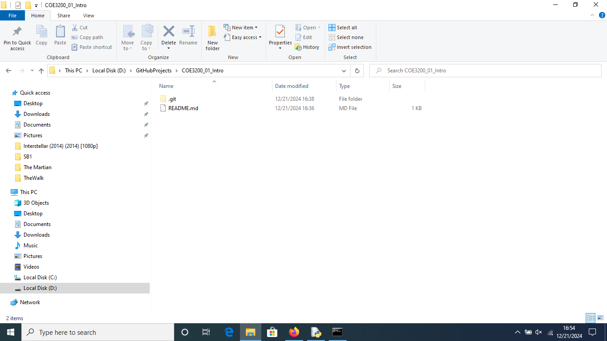
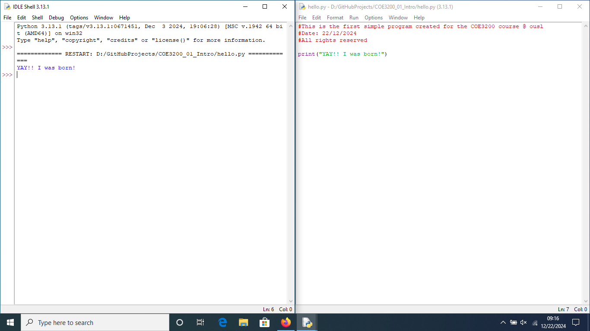
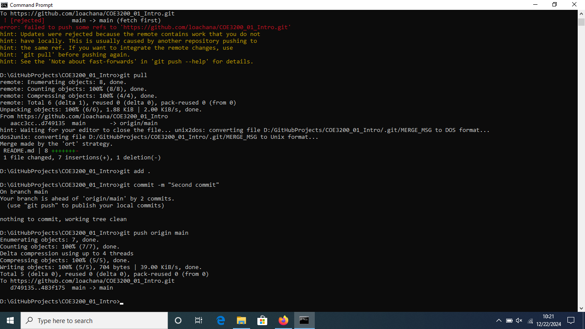
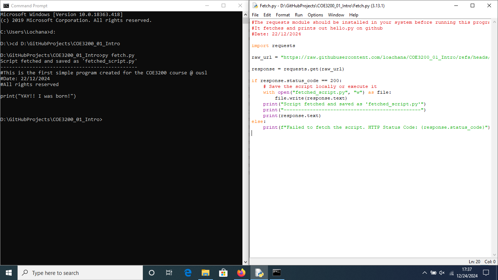

<strong># COE3200_01_Intro</strong>

<i>This repo was created solely for the first experience with GitHub.</i>

This is the first assignment in the series.

All the suggestions are welcome! 

<h2 align="center"><strong>Some snippets during the process</strong></h2>

--Copyright by Lochana--

